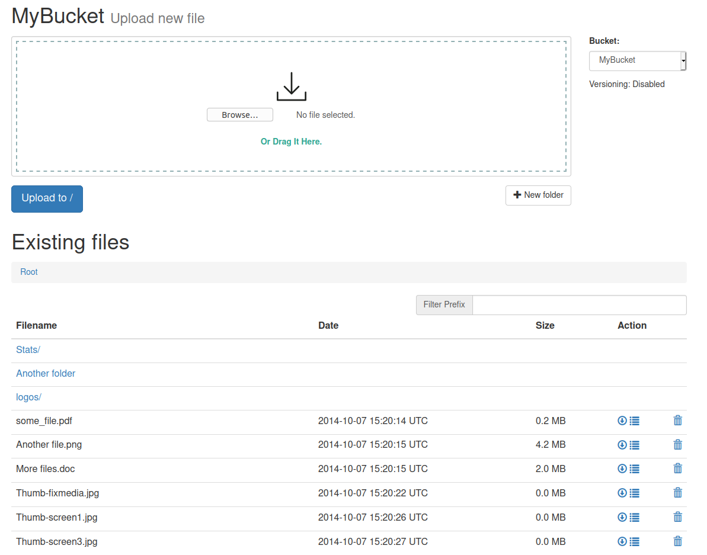

# Simple Upload Tool for S3

A simple tool that offers a Web UI to upload/download data to/from NetApp StorageGRID Webscale.

## Features

* Upload new files to an S3 bucket in StorageGRID
* Filter existing objects by a prefix
* Download existing objects, including older versions
* Public URL copy
* Delete objects
* Folder view & creation supported



## Usage

The tool can either be directly deployed on Docker or Swarm, or manually via command line. Supports NetApp StorageGRID Webscale 10.3 and greater.

### Dockerized

You can use our built image directly:

```bash
docker run -d --name s3uploader \
-e AWS_ACCESS_KEY_ID=secret \
-e AWS_SECRET_ACCESS_KEY=secret \
-e S3_ENDPOINT=https://hostname:port \
-e S3_BUCKET_NAME=bucketname1,buckename2 \
-e SESSION_SECRET=somesecretforcookies \
-e S3_REGION=eu-west-1 \
-p 8080:8080
platoniq/s3-uploader:latest
```

Or build your own Docker image:

```bash
docker build -t s3uploader .
```

Run it:

```bash
docker run -d --name s3uploader \
-e AWS_ACCESS_KEY_ID=secret \
-e AWS_SECRET_ACCESS_KEY=secret \
-e S3_ENDPOINT=https://hostname:port \
-e S3_BUCKET_NAME=bucketname1,buckename2 \
-e SESSION_SECRET=somesecretforcookies \
-e S3_REGION=eu-west-1 \
-p 8080:8080
s3uploader
```

### Direct execution via CLI

Install these gems first:

```bash
gem install sinatra shotgun haml aws-sdk rack-flash3
```

If you are using [rbenv-vars](https://github.com/rbenv/rbenv-vars), just create a file with the variables needed:

`.rbenv-vars`:

```bash
AWS_ACCESS_KEY_ID=supersecret
AWS_SECRET_ACCESS_KEY=supersecret
S3_ENDPOINT=https://hostname:port
S3_BUCKET_NAME=bucketname1,buckename2,...
SESSION_SECRET=somesecretforcookies
S3_REGION=eu-west-1
```

Or built a script like:

```bash
#!/bin/sh

export AWS_ACCESS_KEY_ID='supersecret'
export AWS_SECRET_ACCESS_KEY='supersecret'
export S3_ENDPOINT='https://hostname:port'
export S3_BUCKET_NAME='bucketname1,buckename2,...'
export SESSION_SECRET='somesecretforcookies'
export S3_REGION='eu-west-1'

shotgun --host 0.0.0.0 --port 8080 s3uploader.rb
```
